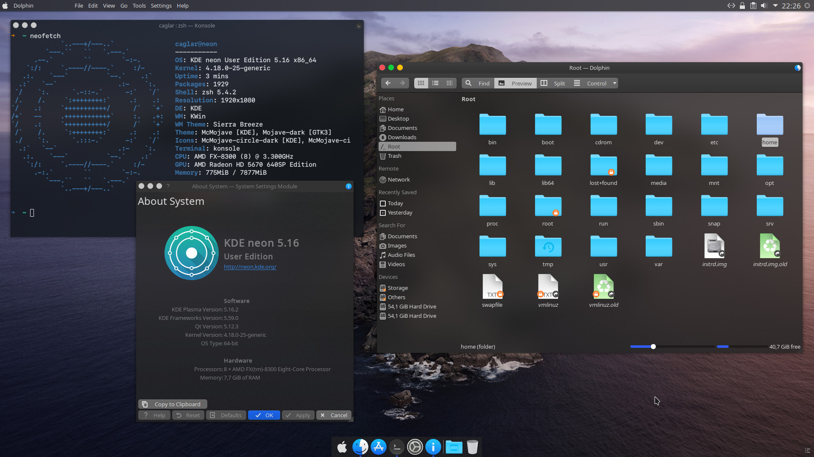

# KvantumEasyMc

Bootstrappes a MacOS-like look with Kvantum and some popular themes available to date.

# Usage

1. Download [this script](https://github.com/caglarturali/KvantumEasyMc/raw/master/KvantumEasyMc.sh).
2. Make it executable.
   `chmod +x KvantumEasyMc.sh`
3. Run.
   `./KvantumEasyMc.sh`

## Tested on
- KDE neon 5.16 User Edition

## Implements

- [Kvantum](https://github.com/tsujan/Kvantum)
- [McMojave KDE Themes](https://github.com/vinceliuice/McMojave-kde)
- [Mojave Gtk Theme](https://github.com/vinceliuice/Mojave-gtk-theme)
- [McMojave-circle Icon Theme](https://github.com/vinceliuice/McMojave-circle)
- [Capitaine Cursors](https://github.com/keeferrourke/capitaine-cursors)
- [SierraBreeze](https://github.com/ishovkun/SierraBreeze)
- [Active Window Control Applet](https://store.kde.org/p/998910/)
- [Latte dock](https://github.com/KDE/latte-dock)
